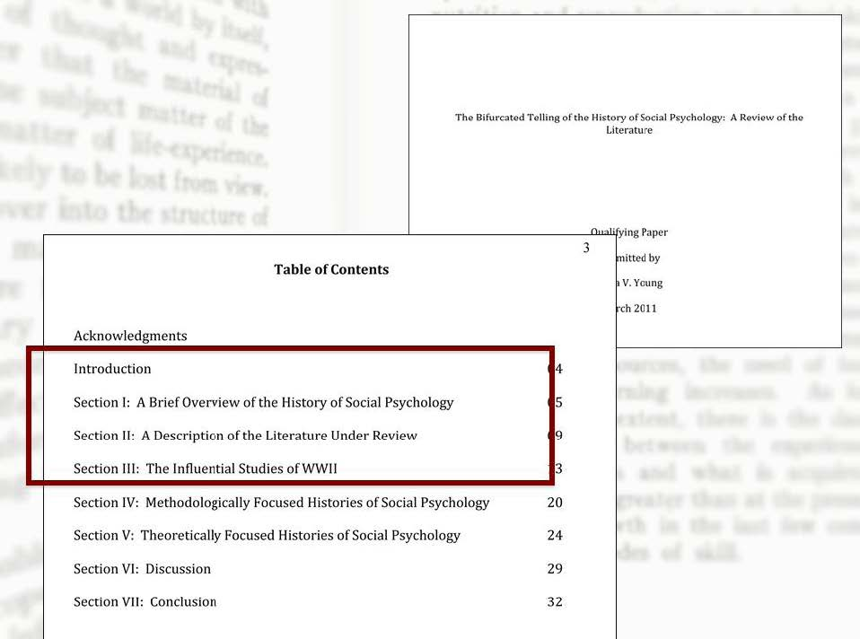

### Definition

A literature review is an assessment of a body of research that addresses a research question.

### Purpose

A literature review:
- Identifies what is already known about an area of study

It may also:
- Identify questions a body of research does not answer       
- Make a case for why further study of research questions is important to a field

### Process

It is a research journey with several steps:
- Framing a research question
- Searching relevant bodies of literature
- Managing search results
- Synthesizing the research literature
- Writing an assessment of the literature

The process is iterative—as you gain understanding, you’ll return to earlier steps to rethink, refine, and rework your literature review.
[The Literature Review: A Research Journey](https://guides.library.harvard.edu/literaturereview)

! The following is a transcript of a video lecture available [here](http://gseacademic.harvard.edu/~instruct/gutman_library/litreview/process/player.html)

What’s involved in writing a literature review? And how do I get started?
Writing a literature review is a research journey.We’ve identified five critical steps and created this guide to help you along the way. Before you begin the journey, this e-lecture will give you an overview of the process.

Now let’s get started with the overview of the research journey. Your first step is to formulate a research question. Your research question is going to guide your journey and define how you take each step. In this step you’ll frame a question based on your initial research on and understanding of a topic.

With your research question in hand, and using its language as a starting point, you’re ready to take the step of searching the literature. In this step, you’ll be standing on the ‘shoulders of giants’ by collecting prior research.

Search article databases, the library catalog, Google Scholar, and other sources to find scholarly information. Evaluate what you find and select articles, books, and other resources that best address your research question. Since your journey may be long, it’s important that your question is one which interests you and is worthy of research.

Your third step is to manage all your gathered information. Managing and organizing your data allows you to know where you’ve been, where you are, and where you’re going on the research journey.

Choose a research management tool like RefWorks, EndNote, Zotero, or Mendeley to help you stay organized. Using one of these tools, together with a well-developed note-taking system, will come in handy when you’re writing and citing your literature review!

All along you’ll be using your brain. But in the fourth step your brain is the most important tool. While researching and organizing your paper, you’ll have collected a lot of information from many different sources.

In this step, you’ll read through your resources to understand, analyze, critique, and synthesize the research literature.

The fifth step in the research journey is to write the literature review. Writing is not separate from the research journey. Writing is the researcher’s voice. Writing is your opportunity to communicate how the literature addresses your research question. A well-written literature review reflects your scholarly accomplishment.

One more thing: Writing a literature review is a journey, but it’s not always a straight path from one point to another. One step does lead to another, but sometimes your research or reading will point you back to earlier steps as you learn more about your topic and the literature. Be prepared to engage in an exciting, iterative journey.

---

! The following is a transcript of a video lecture available [here](http://gseacademic.harvard.edu/~instruct/gutman_library/litreview/defpurpose/player.html)

Writing a literature review is an inevitable part of being a graduate student. So, before you begin your research journey, it helps to understand what a “literature review” is and why it is important.

Let’s begin with a definition: A literature review is an assessment of a body of research that addresses a research question.

You may need to do a literature review as a part of a course assignment, a capstone project, a master’s thesis, dissertation, or journal article. No matter the context, a literature review is an essential part of the research process

But what is the purpose of a literature review? A literature review identifies what is already known about an area of study.

After synthesizing all you’ve discovered and read on your journey, you’ll draw conclusions about how the literature answers the research question you posed. Depending on the project, a literature review may also identify questions a body of research does not answer and make a case for why further study of those questions is important to the field.

Finally, a well-argued literature review lets you demonstrate to your instructor or thesis committee what you know about a field of study.

Your instructor or advisor may assume you know what a literature review is and that you understand what they are expecting from you.

You might hear phrases like: “What does the literature show us?” “Connect your ideas to the literature.” “Survey the literature on the topic.” Well, before you can review the literature, you need to make sure you know what is meant by “the literature.”

A good definition of “the literature” is that it is a collection of all the scholarly writings on a topic.

These writings can be in the form of scholarly, peer reviewed articles; books; chapters in edited books; and other sources like conference proceedings (sometimes called annual meetings or conventions). The literature also includes dissertations written by other graduate students. Collectively, these make up the literature.

Visually, the literature might look like this. Often there are major works that have been written on a topic, and then other, later, works that build on them. These later works tend to be extending or responding to the original papers in some way.

Basically, the literature is a continuously evolving network of scholarly works that interact with each other. As you do your own research, you’ll begin to understand the relationships in this evolving web and how your own ideas connect to it.

So, how do you turn a network of articles into a cohesive review of the literature? How do you find and tell the “story” behind your research topic?

Reviewing the literature is like participating in a conversation. As you read and evaluate articles you begin to understand how they are connected and how they form the story that the authors are telling. Then you start to formulate your own response or contribution.

This process - discovering relationships in the literature and developing and connecting your own ideas to it - is what helps you turn a network of articles into a coherent review of the literature.

So what does a literature review look like? There are different types of literature reviews that you may encounter, or be required to write, while in graduate school. Literature reviews can range from being selective to comprehensive. They can also be part of a larger work or stand alone.

A course assignment is an example of a selective review. It focuses on a small segment of the literature on a topic and makes up the entire work. The literature review in a thesis or dissertation is an example of a comprehensive review that is part of a larger work.

A literature review that introduces an article can look like this. Here is an article about an anti-poverty program. Here is the literature review. In this article it’s part of the introduction. You can tell that the introduction includes a literature review because it discusses important research that has already been published on this topic.

Here’s an example of a stand-alone literature review article, in this case, about online teacher development. The article’s abstract states that this is a review of the literature on the topic. Some review articles will have the term ‘literature review’ in the title, but many, like this one, do not. In-depth review articles like this are an excellent starting place for research on a topic.

A qualifying paper written as part of a doctoral program requires you to demonstrate your ability to analyze literature critically. A review of the literature like the one shown here meets that requirement.

 The Literature Review: A Research Journey is licensed under a <a rel="license" href="http://creativecommons.org/licenses/by/4.0/">Creative Commons Attribution 4.0 International License</a>. Based on a work at <a xmlns:dct="http://purl.org/dc/terms/" href="https://guides.library.harvard.edu/literaturereview" rel="dct:source">https://guides.library.harvard.edu/literaturereview</a>.
