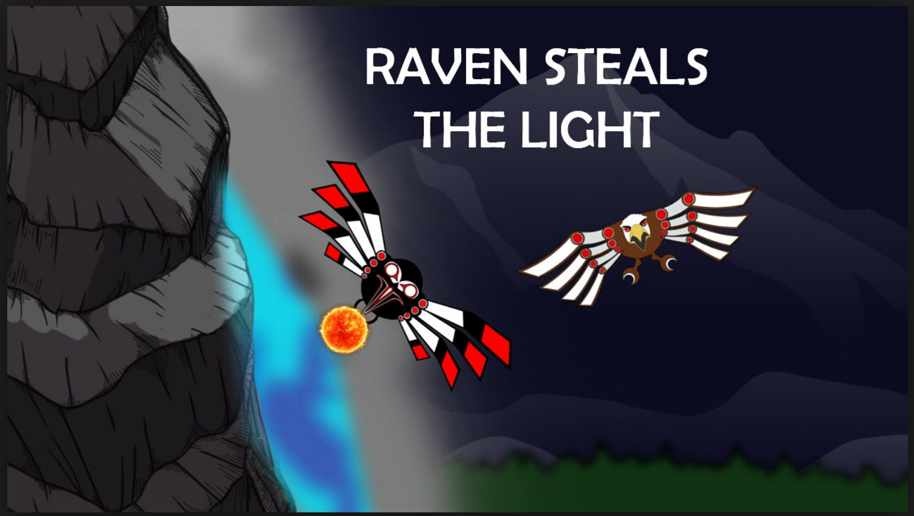

People tell stories to make sense of the world.

[plugin:youtube](https://www.youtube.com/watch?v=nxLGKzkbM84)

Photo by Kiwihug on Unsplash

Photo by Syed Hussaini on Unsplash

#### Definition

> Broadly defined as a discourse with clear sequential order that connects events in a meaningful way for a definite audience and thus offer insight about the world and or peoples’ experience of it (Hinchman,1997).

> Is the use of lived and told stories to understand experiences. It is a collaborative process between the researcher and participants. It occurs over a long period of time in one or many places as a result of social interactions in social environments (Johnson & Christensen, 2017, p. 425)

Narrative inquiry is based on Dewey's two criteria of experience:
- continuity, or the idea that a person's experiences are shaped by their past experiences and that they shape future experiences;
- interaction between a person and their environment
