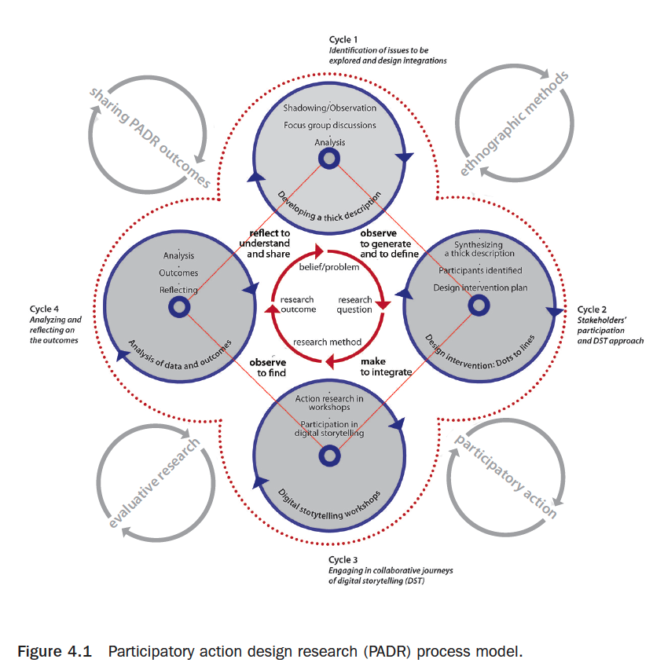

!!! Mumtaz, N. (2015). Participatory action-based design research. In D. H. Conrad & A. Sinner (Eds.), *Creating together: Participatory, community-based, and collaborative arts practices and scholarship across Canada* (pp. 51–68). Waterloo, Ontario: Wilfrid Laurier University Press.

### Abstract

In the spirit of visual communication design (VCD), participatory design (PD) research, and community service learning, my master of design thesis project, Journeys and Voices Together, was undertaken on the premise that design can influence positive social change in the context of new-immigrant/refugee communities’ health issues. Poggenpohl identifies “design as a form of social practice” (2009, p. 19). She suggests that it has a hidden strength, which makes it particularly suitable to help identify and address interlinked social problems that societies face (Poggenpohl, 2002). The emergent design1 approach I used went beyond responding to client briefs and offered a shift in design thinking, with the aim of exploring how collaborative/participatory methods in design process could contribute to initiating and sustaining effective communication for healthier communities.

### Keywords:

---

Extracted Annotations (2019-10-28, 7:07:23 AM)

> premise that design can influence positive social change in the context of new-immigrant/refugee communities' health issues. (p. 52)

> Buchanan (2001) articulates that at the core of the call for "socially responsible design" is the belief that "design is fundamentally grounded in human dignity and human rights" (p. 35). (p. 54)

> enhanced understanding of people, society, their habitat, and environment. Gregory (2009) concurs with Frascara when she points out that, "designers already operate in multidisciplinary and in-between spaces so they can create design spaces for new kinds of participation and reciprocity" (p. 261). (p. 54)

> Following the constructivist paradigm, participatory design practice involves stakeholder participants directly in design planning, creation, and evaluation processes to elicit tacit knowledge of their communities. (p. 55)

> Moving from individual to collaborative practice, PD is design activity grounded in community participation, involving co-creation and co-evaluation of the process, resulting in an end product (artifact). In PD, the aim is to facilitate participant stakeholders' abilities to address practical social problems while building their capacities to learn, think, evaluate, and rethink through the creative design process (Fuad-Luke, 2009; Kirrpendorf, 2006; Manzini, 2007; Poggenpohl, 2002, 2009). (p. 55)

> More recently, PD has found its way to Canada, where it is growing in significance. Gavin Renwick4 (2006), for example, recently brought his PD practice, honed in Scotland, to the Canadian scholarly landscape. His practice bridges design with research methods informed by the Indigenous wisdom practices of the North to form collaborative envisionments focused on holistic participatory processes of creation rather than on commoditized creativity. (p. 55)

> Reason articulates that research through participation is more than knowledge creation—it is also about healing the alienation that, he points out, characterizes the modern-world experience. (p. 56)

> The research plan that emerged involved four interrelated stages: (1) developing a thick description of the context; (2) holding digital storytelling workshops; (3) obtaining evaluation feedback and expert interviews; and (4) reflecting and project outcomes. (p. 57)

> The emergence of digital storytelling (DST) has connected the age-old art of storytelling with digital media to develop an understanding of human experiences in world scenarios rapidly changed by technology. DST can employ a diverse range of technologies in its creative processes, but its focus and purpose are human and participatory (Bromley, 2010; Fields & Diaz, 2008; Hartley & William, 2009). (p. 59)

> I refer to a "digital story" (DS) in the context of my project as a digital time-based artifact of still photographs, images, artwork, music, and first-person audio narration. I used DST as a method of visual ethnographic research, and DST workshops as means of collaboratively designing artifacts (DSs), which could be shared through a website. (p. 60)

> The DST workshops took place in the Visual Communication Design studios in the Fine Arts Building at the University of Alberta in Edmonton. The group met for five workshop sessions (each 2 to 2.5 hours long) during June and July 2010. The following questions opened our story circles: What messages need to be communicated to help bring awareness about the challenges of new-immigrant and refugee communities so they can access healthier lives? How can these messages best be communicated through the visual medium of photo and voice? In response to these questions participants explored ways of digitally sharing their stories to raise awareness about the well-being of their communities. (p. 60)

> As the DST workshops progressed, my role as facilitator and participatory design researcher became complex; it required me to shift roles between researcher, teacher, facilitator, and designer. The original plan was adapted and modified to respond to "the dynamic needs of participant stakeholders who were participating in the design activity" (Carroll, 2006, p. 7). (p. 60)

> Carroll (2006) concurs with Simon (1996) that design activity is not a journey towards a static single goal, but a process that leads to identifying new goals, thus giving rise to a new cycle of design activity. (p. 62)

> Digital storytelling in this study represented a design process as well a design product for: archiving experiences and ideas (creative archives), transferring ideas (pedagogy), and exploring ideas (research). (p. 65)

> I learned, as Bonsiepe (in Fathers, 2003) emphasizes, that design problems for social change in marginalized communities should not be addressed through a "benevolent paternalistic approach" (p. 48), that is, from outside the concerned community. Direct participation of stakeholders in the design process is identified as essential for sustained social change. (p. 65)

> According to Gregory (2009) the process of mutual learning is more than extracting knowledge; she believes it is about circulating knowledge that is co-constructed through trans-disciplinary design collaborations. (p. 66)
