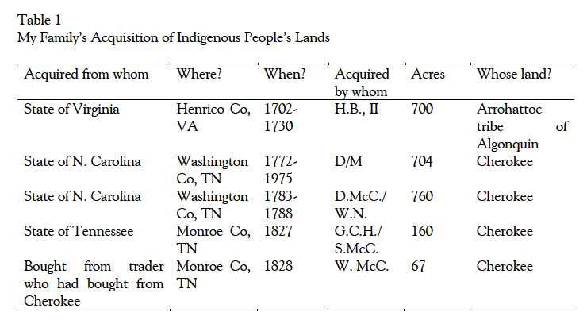
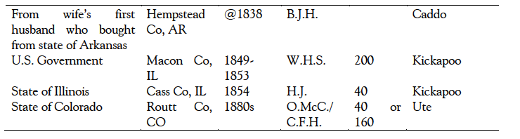

!!! Sleeter, C. E. (2016). Critical Family History: Situating Family within Contexts of Power Relationships. *Journal of Multidisciplinary Research (1947-2900), 8*(1), 11–24. Retrieved from [http://ezproxy.library.uvic.ca/login?url=http://search.ebscohost.com/login.aspx?direct=true&db=aph&AN=117534736&site=ehost-live&scope=site](http://ezproxy.library.uvic.ca/login?url=http://search.ebscohost.com/login.aspx?direct=true&db=aph&AN=117534736&site=ehost-live&scope=site).

Extracted Annotations (2019-11-21, 7:02:16 AM)

### Abstract

> Family history research has become increasingly popular as online genealogical research tools have become widely available. However, family historians, particularly those from dominant social groups, usually end up interpreting their family story within dominant national narratives. As a form of *memory work* (Kuhn, 1995), family history has the potential to unearth hidden or *forgotten* memories about the past and its implication for the present. Drawing on theoretical tools of the critical theoretical traditions, critical family history interrogates the interaction between family and context, with a particular focus on power relationships among sociocultural groups. In this article, I use my own family history to illustrate the recovery of a silenced or suppressed national narrative. Specifically, through an examination of property records and wills, I show how social relationships that colonization forged, rather than being a relic of the past, live on in the present, and how family history can challenge a national mythology that minimizes the importance and ongoing impact of colonization.

### Keywords
historical memory, national mythology, critical race theory, colonization, family wealth (p. 11)

> Studies of why people research family history find that many seek a sense of belonging to place and community extending back in time, anchoring personal identity (Bennett, 2015; Bottero, 2015; Kramer, 2011). Family memories and personal identity, however, are never entirely private matters. Rather, they reflect public, national narratives, often tacitly incorporating the themes and the silences within those narratives (Kuhn, 1995; Lenz & Bjerg, 2007). (p. 11)

> Family History and Context (p. 12)

> After interviewing family historians about how they seek information, Darby and Clough (2013) found that most of their research participants focused on building out the ancestral family tree. Less than 20% sought contextual information about their ancestors' lives. (p. 12)

> It appears to be family historians of dominant social groups who are least likely to contextualize the family within larger socio-cultural and power relationships. (p. 12)

> The White genealogists, tracing individual ancestors, used the past only as a background context in which to locate their ancestors within a traditional narrative that minimizes racism. In contrast, the Black genealogists linked their family's story with a larger narrative of navigating and challenging racial oppression. (p. 12)

> While family historians from dominant social groups may view social context as irrelevant, I suggest that ignoring context leads to uncritical appropriation of national mythologies. (p. 12)

> White groups of teachers in Canada, Norquay (1998) noticed systematic gaps and silences in stories they told about their family immigrant histories. The teachers generally interpreted their family histories in a way that *reflected officially sanctioned understandings of immigrants and immigration* (p. 179) - the myth that Canada, despite not welcoming or affording opportunity to everyone, enabled impoverished immigrants to prosper. (p. 12)

> But, national mythologies are patterned reconstructions of the past; they are not the past itself (Halbwachs, 1992; Rovinello, 2013). (p. 12)

> Kuhn (1995) urges us to ask: Exactly what is being remembered, and, perhaps more importantly, what is being forgotten? (p. 13)

> Family and National Mythology (p. 13)

> Generally, nation-building projects involve constructing a national narrative based on myths of origin and identity, and building personal psychological identification with that narrative (Bouchard, 2013; Van Alphen & Carretero, 2015). (p. 13)

> In the U.S., historical nostalgia linked with amnesia characterizes the dominant national mythology. (p. 13)

> The national mythology tells of immigrants arriving in an empty space and receiving the opportunity to pull themselves up through hard work. Homesteading enabled immigrants and other Whites to acquire *free land* that purportedly belonged to no one (Freund, 2013). (p. 13)

> I coined the term *critical family history* to challenge family historians to construct their histories in the context of social relationships forged through colonization, racism, and other relations of power (Sleeter, 2011; 2014). (p. 14)

> Critical race theory, which theory emerged in the U.S. during the 1980s, examines systemic and customary ways in which racism works (Delgado, 1995). (p. 14)

> critical race theory in colonial societies examines how, through the commodification of land and people for profit, colonizers established the basis for their own identity to function like property, thereby cementing material advantages with dominant ethnic or racial identities. (p. 14)

> Situating a Question (p. 14)

> My research process alternated iteratively between seeking family tree data (i.e., data about individual ancestors and family units), and seeking social context data (for example, data regarding other socio-cultural groups whose histories intersected with those of my ancestors). (p. 15)

> The question I explore below emerged while examining land records and wills of my ancestors. (p. 15)

> I gathered data on land values, where I could, from deeds, digitized newspaper articles, and Census data. I located original wills, wills on microfiche, and transcribed wills mainly in county courthouses in Tennessee. (p. 15)

> A pattern I began to notice was that several ancestors, in different states and at different times, acquired land from the U.S. government or a state government, rather than from a specific person. I gradually realized these ancestors, knowingly or not, directly profited from U.S. policies that took land from the Indigenous peoples. (p. 15)

> Table 1 specifies (1) from which governmental entity the land was acquired, (2) the county and state in which it was located, (3) when my ancestor(s) acquired the land, (4) who acquired it (using initials rather than names), (5) how many acres were acquired, and (6) the Indigenous tribe or nation that had lost that land. (p. 15)

> In what follows, I trace the violent transfer of land from Native American to White hands, and its eventual impact on me. I do this to explore the larger question of how colonization constructed oppressive power relations historically, how that history still implicates us, and how critical family history can change the national narrative. (p. 16)

> Dispossessing Indigenous Nations, Transferring Land to Whites (p. 16)

> Writing about the process of seizure and sale of Indigenous peoples' land in Tennessee, Phelan (1888) summarized a pattern that repeated across what became the United States, a story that is ignored in the popular national mythology: The general groundwork was the same in all cases. Indian lands were taken possession of and then improved. The Indians entered into hostilities, and were eventually defeated and compelled to sue for peace. Treaties were made and increased territory given to the whites, and new boundary lines were established, which were again overstepped. Act after act was passed to legalize usurpations, and all the worst features of civilization were brought into play to win a field for the foundation of a government. (p. 51) (p. 16)

> Indigenous peoples' attempts to protect their lands from growing incursions of Whites were always met with conflict, ramped up U.S. military pressure, and re-written treaties in which the U.S. government forced the tribes to cede it more land. (p. 17)

> President Andrew Jackson pushed through Congress the Indian Removal Act of 1830 that gave him power to negotiate removal treaties with Indians east of the Mississippi. In 1832, the U.S. Supreme Court ruled in favor of the Cherokee as a sovereign nation. However, in 1836, U.S. officials negotiated with a small minority of Cherokee that the whole nation would move west. Although the Cherokee National Council did not approve the treaty, the U.S. Senate did, and in 1838, the U.S. military invaded the Cherokee Nation, expelling about 18,000 Cherokees to Oklahoma on the *Trail of Tears.* (p. 17)

> The Utes experienced much the same process of expulsion; the Homestead Act of 1862 accelerated that process. That act allowed a settler to exchange five years of living on public land for 160 patented acres for a family, or 40 acres for a single person, paying only the cost of the patent and surveying. (p. 18)

> (According to Williams [2000], while theoretically any citizen could purchase land, few African Americans were able to buy land; the vast bulk of it went to Whites). (p. 18)

> White River Indian Agent Nathan Meeker taunted and browbeat the Utes until a group of them finally retaliated, ambushing the agency in 1879 and killing eleven White people. Newspapers quickly published articles urging that, *The Utes must go,* viewing the massacre as evidence that the army and agent system could not control them. In 1880, the Colorado State legislature overwhelmingly passed resolution a demanding expulsion of Utes; many Whites wanted simply to exterminate them. (p. 18)

> Building White Wealth on Stolen Land (p. 18)

> Discussion (p. 19)

> As Kuhn (1995) explains, *the past is unavoidably re-written, revised, through memory (p. 155). (p. 19)

> The larger story my research uncovered is one of White Americans amassing wealth at the direct expense of Indigenous peoples, then reframing historical memory in terms of hard work, omitting the history of violent theft. (p. 20)

> White North Americans generally see conquest as having happened in the distant past, *tragic* in its treatment of Indigenous peoples, but not personally relevant today (Norquay, 1998; Solomon, Portelli, Daniel, & Campbell, 2005). (p. 20)

> In 2013, while the median household income of American Indian families was $36,252, for the nation as a whole it was $52,176. While 29.2% of American Indians lived in poverty, this was true of 15.9% of the nation as a whole; American Indians have the highest poverty rate of any racial/ethnic group (U.S. Census Bureau, 2014). There are historical reasons for these disparities. White people constructed a system that enabled land and other forms of wealth to flow into, then remain in, White hands. (p. 20)

> According to Churchill (1993), Indigenous peoples have traditionally regarded the land as part of the sacred natural order, whose health is *an absolute requirement for their continued existence* (p. 17). Humans live in relationship to other elements of nature; humans *own* none of these. In contrast, Europeans, especially in the context of capitalism, came to define land not as sacred, but as private real estate people could buy and sell for profit. (p. 20)

> White people's institutionalized desire to gain wealth and keep it in the family over generations (which my family history research illuminated), and Indigenous peoples' continued marginalization and poverty, reflect ongoing colonial relationships. Similarly, White historical narratives that minimize genocide and land theft, and that distance White ancestors from violence perpetrated against indigenous peoples enable White people to claim moral innocence and to view White wealth as legitimately accumulated. (p. 20)

> Sleeter, C. E. (2011). Becoming white: Reinterpreting a family story by putting race back into the picture. Race Ethnicity & Education, 14(3), 421-433. Sleeter, C. E. (2014). Inheriting footholds and cushions: Family legacies and institutional racism. In K. Luschen & J. Flores Carmona (Eds.) Crafting critical stories: Toward pedagogies and methodologies of collaboration, inclusion, and voice (pp. 11-26). New York, NY: Peter Lang. (p. 22)
