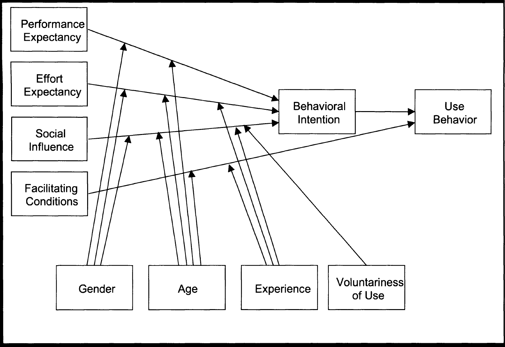

!!! Venkatesh, V., Morris, M. G., Davis, G. B., & Davis, F. D. (2003). User Acceptance of Information Technology: Toward a Unified View. MIS Quarterly, 27(3), 425–478. JSTOR. https://doi.org/10/gc8zn2

##### Extracted Annotations (2020-04-18, 11:46:37 a.m.)

> Abstract Information technology (IT) acceptance research has yielded many competing models, each with different sets of acceptance determinants. In this paper, we (1) review user acceptance literature and discuss eight prominent models, (2) empirically compare the eight models and their extensions, (3) formulate a unified model that integrates elements across the eight models, and (4) empirically validate the unified model. The eight models reviewed are the theory of reasoned action, the technology acceptance model, the motivational model, the theory of planned behavior, a model combining the technology acceptance model and the theory of planned behavior, the model of PC utilization, the innovation diffusion theory, and the social cognitive theory. Using data from four organizations over a six-month period with three points of measurement, the eight models explained between 17 percent and 53 percent of the variance in user intentions to use information technology. Next, a unified model, called the Unified Theory of Acceptance and Use of Technology (UTA UT), was formulated, with four core determinants of intention and usage, and up to four moderators of key relationships. UTA UT was then tested using the original data and found to outperform the eight individual models (adjusted R2 of 69 percent). UTAUT was then confirmed with data from two new organizations with similar R2 results (adjusted of 70 percent). UTA UT thus provides a useful tool for managers needing to assess the likelihood of success for new technology introductions and helps them understand the drivers of acceptance in order to proactively design interventions (including training, marketing, etc.) targeted at populations of users that may be less inclined to adopt and use new systems. The paper also makes several recommendations for future research including developing a deeper understanding of the dynamic influences studied here, refining measurement of the core constructs used in UTAUT, and understanding the organizational outcomes associated with new technology use. (p. 427)

> Keywords: Theory of planned behavior, innovation characteristics, technology acceptance model, social cognitive theory, unified model, integrated model (p. 427)

##### Introduction (p. 427)

> The current work has the following objectives: (p. 427)

> To review the extant user acceptance models: (p. 427)

> To empirically compare the eight models: (p. 427)

> To formulate the Unified Theory of Acceptance and Use of Technology (UTAUT): (p. 427)

> To empirically validate UTAUT (p. 427)

##### Review of Extant User Acceptance Models (p. 428)

##### Description of Models and Constructs (p. 428)

> the theoretical models to be included in the present review, comparison, and synthesis employ intention and/or usage as the key dependent variable. The goal here is to understand usage as the dependent variable. The role of intention as a predictor of behavior (e.g., usage) is critical and has been well-established in IS and the reference disciplines (see Ajzen 1991; Sheppard et al. 1988; Taylor and Todd 1995b). (p. 428)

##### Prior Model Tests and Model Comparisons (p. 428)

##### Formulation of the Unified Theory of Acceptance and Use of Technology (UTAUT) (p. 447)

> Seven constructs appeared to be significant direct determinants of intention or usage in one or more of the individual models (Tables 5 and 6). Of these, we theorize that four constructs will play a significant role as direct determinants of user acceptance and usage behavior: performance expectancy, effort expectancy, social influence, and facilitating conditions. (p. 448)

> As will be explained below, attitude toward using technology, selfefficacy, and anxiety are theorized not to be direct determinants of intention. (p. 448)

> Figure 3 presents the research model. (p. 448)

##### Performance Expectancy (p. 448)

> Performance expectancy is defined as the degree to which an individual believes that using the system will help him or her to attain gains in job performance. (p. 448)

> H1: The influence of performance expectancy on behavioral intention will be moderated by gender and age, such that the effect will be stronger for men and particularly for younger men. (p. 451)

##### Effort Expectancy (p. 451)

> Effort expectancy is defined as the degree of ease associated with the use of the system. (p. 451)

> Venkatesh and Morris (2000), drawing upon other research (e.g., Bern and Allen 1974; Bozionelos 1996), suggest that effort expectancy is more salient for women than for men. As noted earlier, the gender differences predicted here could be driven by cognitions related to gender roles (e.g., Lynott and McCandless 2000; Motowidlo 1982; Wong et al. 1985). (p. 451)

> Increased age has been shown to be associated with difficulty in processing complex stimuli and allocating attention to information on the job (Plude and Hoyer 1985), both of which may be necessary when using software systems. (p. 451)

> H2: The influence of effort expectancy on behavioral intention will be moderated by gender, age, and experience, such that the effect will be stronger for women, particularly younger women, and particularly at early stages of experience. (p. 451)

##### Social Influence (p. 452)

> Social influence is defined as the degree to which an individual perceives that important others believe he or she should use the new system. (p. 452)

> None of the social influence constructs are significant in voluntary contexts; however, each becomes significant when use is mandated. Venkatesh and Davis (2000) suggested that such effects could be attributed to compliance in mandatory contexts that causes social influences to have a direct effect on intention; in contrast, social influence in voluntary contexts operates by influencing perceptions about the technology-the mechanisms at play here are internalization and identification. (p. 453)

> the compliance mechanism causes an individual to simply alter his or her intention in response to the social pressure-i.e., the individual intends to comply with the social influence. (p. 453)

> Prior research suggests that individuals are more likely to comply with others' expectations when those referent others have the ability to reward the desired behavior or punish nonbehavior (e.g., French and Raven 1959; Warshaw 1980). (p. 454)

> This normative pressure will attenuate over time as increasing experience provides a more instrumental (rather than social) basis for individual intention to use the system. (p. 454)

> Theory suggests that women tend to be more sensitive to others' opinions and therefore find social influence to be more salient when forming an intention to use new technology (Miller 1976; Venkatesh et al. 2000), with the effect declining with experience (Venkatesh and Morris 2000). As in the case of performance and effort expectancies, gender effects may be driven by psychological phenomena embodied within socially constructed gender roles (e.g., Lubinski et al. 1983). (p. 454)

> Rhodes' (1983) meta-analytic review of age effects concluded that affiliation needs increase with age, suggesting that older workers are more likely to place increased salience on social influences, with the effect declining with experience (Morris and Venkatesh 2000). (p. 454)

> H3: The influence of social influence on behavioral intention will be moderated by gender, age, voluntariness, and experience, such that the effect will be stronger for women, particularly older women, particularly in mandatory settings in the early stages of experience. (p. 454)

##### Facilitating Conditions (p. 454)

> Facilitating conditions are defined as the degree to which an individual believes that an organizational and technical infrastructure exists to support use of the system. (p. 454)

> In short, when both performance expectancy constructs and effort expectancy constructs are present, facilitating conditions becomes nonsignificant in predicting intention. (p. 455)

> not H4a: Facilitating conditions will have a significant influence on behavioral intention. (p. 455)

> The empirical results also indicate that facilitating conditions do have a direct influence on usage beyond that explained by behavioral intentions alone (see Table 8). (p. 455)

> Thus, when moderated by experience and age, facilitating conditions will have a significant influence on usage behavior. (p. 455)

> H4b: The influence offacilitating conditions on usage will be moderated by age and experience, such that the effect will be stronger for older workers, particularly with increasing experience. (p. 456)

##### Constructs Theorized Not to Be Direct Determinants of Intention (p. 456)

> Although self-efficacy and anxiety appeared to be significant direct determinants of intention in SCT (see Tables 5 and 6), UTAUT does not include them as direct determinants. Previous research (Venkatesh 2000) has shown self-efficacy and anxiety to be conceptually and empirically distinct from effort expectancy (perceived ease of use). Self-efficacy and anxiety have been modeled as indirect determinants of intention fully mediated by perceived ease of use (Venkatesh 2000). (p. 456)

> not H5a: Computer self-efficacy will have a significant influence on behavioral intention. 6 not H5b: Compute anxiety will have a significant influence on behavioral intention. 7 (p. 456)

> Attitude toward using technology is defined as an individual's overall affective reaction to using a system. (p. 456)

> Given that we expect strong relationships in UTAUT between performance expectancy and intention, and between effort expectancy and intention, we believe that, consistent with the logic developed here, attitude toward using technology will not have a direct or interactive influence on intention. (p. 457)

> H5c: Attitude toward using technology will not have a significant influence on behavioral intention. (p. 457)

##### Behavioral Intention (p. 457)

> Consistent with the underlying theory for all of the intention models discussed in this paper, we 10 expect that behavioral intention will have a significant positive influence on technology usage. (p. 457)

> H6: Behavioral intention will have a significant positive influence on usage. (p. 457)

##### Discussion (p. 468)

> The present research set out to integrate the fragmented theory and research on individual acceptance of information technology into a unified theoretical model that captures the essential elements of eight previously established models. (p. 468)

> These tests provided strong empirical support for UTAUT, which posits three direct determinants of intention to use (performance expectancy, effort expectancy, and social influence) and two direct determinants of usage behavior (intention and facilitating conditions). (p. 468)

> Significant moderating influences of experience, voluntariness, gender, and age were confirmed as integral features of UTAUT. (p. 468)

> The effect of effort expectancy on intention is also moderated by gender and age such that it is more significant for women and older workers, and those effects decrease with experience. (p. 468)

> The effect of social influence on intention is contingent on all four moderators included here such that we found it to be nonsignificant when the data were analyzed without the inclusion of moderators. (p. 468)

> Finally, the effect of facilitating conditions on usage was only significant when examined in conjunction with the moderating effects of age and experience-Le., they only matter for older workers in later stages of experience. (p. 468)

> From a theoretical perspective, UTAUT provides a refined view of how the determinants of intention and behavior evolve over time. It is important to emphasize that most of the key relationships in the model are moderated. For example, age has received very little attention in the technology acceptance research literature, yet our results indicate that it moderates all of the key relationships in the model. (p. 470)

> Gender, which has received some recent attention, is also a key moderating influence; however, consistent with findings in the sociology and social psychology literature (e.g., Levy 1988), it appears to work in concert with age, a heretofore unexamined interaction. (p. 470)

> Finally, although gender moderates three key relationships, it is imperative to understand the importance of gender roles and the possibility that > psychological gender is the root cause for the effects observed. Empirical evidence has demonstrated that gender roles can have a profound impact on individual attitudes and behaviors both within and outside the workplace (e.g., Baril et al. 1989; Feldman and Aschenbrenner 1983; Jagacinski 1987; Keys 1985; Roberts 1997; Sachs et al. 1992; Wong et al. 1985). Specifically, gender effects observed here could be a manifestation of effects caused by masculinity, femininity, and androgyny rather than just > biological sex (e.g., Lubinski et al. 1983). (p. 470)
