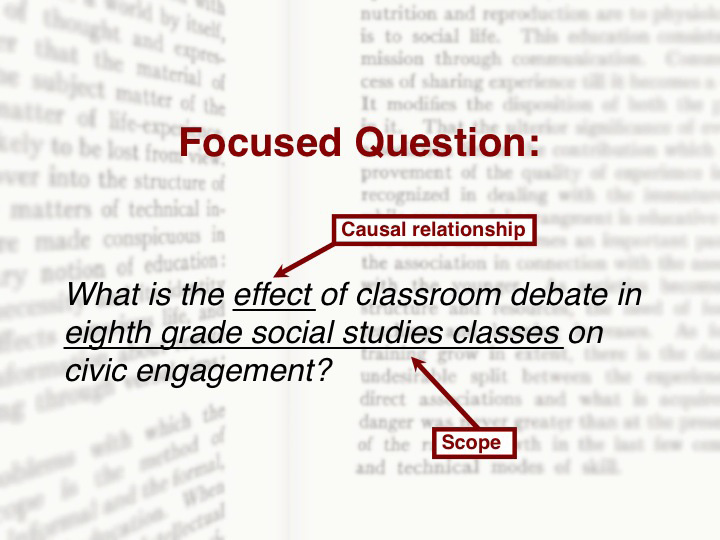

#### Definition

A research question defines the scope of an area of inquiry. It asks about the causal relationship between x and y.  It is founded on a deep understanding of works in the relevant area(s) of study and informed by both what is known and not yet known in that area.

#### Purpose

The research question guides your literature review by establishing its parameters and articulating a researchable question.

#### Process

To frame a research question

- Identify an area of study which is of interest
- Refine this area of study based on an exploration of the literature
-  Examine research variables (e.g., gender, age, context, etc.)  which influence your question
-  Map the literature to identify relationships. Mapped relationships may highlight issues or connections within the field.
-  Draw on what you have learned to draft your research question

!!! Remember: the literature review is an iterative process!

! The following is a transcript of a video lecture available [here](http://gseacademic.harvard.edu/~instruct/gutman_library/litreview/question/player.html).

Framing your research question is critical to your research journey. The research question establishes your area of inquiry and guides your argument. The question you construct maps your journey from initial exploration to final review.

By the end of this E-lecture, you’ll be able to:
- Identify and narrow an area of interest to a specific, researchable topic
- Propose a relationship between x and y to investigate
- Construct a research question based on a causal relationship

You may wonder: how do researchers develop a question? First, they identify an area of study that is of interest to them. You may already have ideas for research based on an academic interest or professional experience.

From this broad interest, you’ll need to narrow or refine your inquiry

For example, you may be knowledgeable about classroom discussion based on your own teaching and learning experiences. A broad question such as

>‘what is the relationship between classroom debate and student learning?’

might be a starting point. From that broad question you’ll formulate a focused, researchable question.

Begin by exploring the literature, and as you explore, consider:
- What interests you about this topic?
- Does the topic present an issue that puzzles, excites, challenges or confronts you?

Your research journey may be long and your question needs to sustain your interest from the first step to the end.

To get at exactly what you want to know or understand, look at your topic from different perspectives. Identify research variables to help further refine your question. For example: What population, educational level, or discipline (if any) will you focus on?

After connecting your own interests to what you discover in your initial reading, you may decide to consider the effect of classroom debate within the more focused context of civic engagement.

Now you’re ready to generate a series of questions to help you formulate the causal relationship between classroom debate and civic engagement. They might include:
- Does classroom debate contribute to student learning?
- What does the research say about the challenges of teaching civic engagement?
- Are age-specific developmental skills related to the ability to assume a debate position?

You might like to use [this mind mapping tool](http://www.library.arizona.edu/help/tutorials/mindMap/index.php) to help you generate your own questions.

The questions you ask and the answers you find in the literature help you to arrive at a focused research question. In the case of classroom debate, a focused research question might ask:
> What is the effect of classroom debate in eighth grade social studies classes on civic engagement?

The constructed question meets the definition of a research question, because it defines the scope of the study. It poses a clear question about the causal relationship between classroom debate and civic engagement.

To ensure the success of your research journey, your question should demonstrate knowledge of the related literature. Your question needs to be feasible; finding little literature to support your research questions may mean you identified a new area to be studied or it may mean the question is not measurable. Your question should be meaningful; you want to make a contribution to an area of study.

Remember that the literature review is an iterative process. At each step along the way, you may return to rethink, refine, and rework your research question.

[Student and Faculty Voices](https://guides.library.harvard.edu/c.php?g=310271&p=2071506#s-lg-box-9393036)

---

 The Literature Review: A Research Journey by <a xmlns:cc="http://creativecommons.org/ns#" href="https://lit.madland.ca/home/how-to-lit-review" property="cc:attributionName" rel="cc:attributionURL">Colin Madland</a> is licensed under a <a rel="license" href="http://creativecommons.org/licenses/by/4.0/">Creative Commons Attribution 4.0 International License</a>. Based on a work at <a xmlns:dct="http://purl.org/dc/terms/" href="https://guides.library.harvard.edu/literaturereview" rel="dct:source">https://guides.library.harvard.edu/literaturereview</a>.
